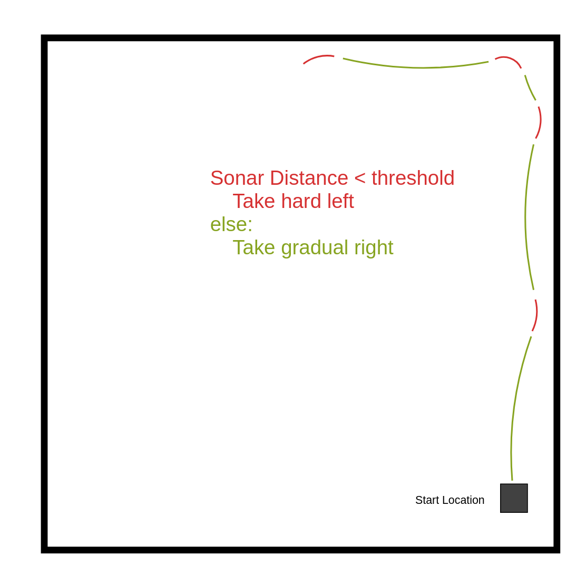

# NanoNinja

## Visual Odometry

While trying to implement visual odometry on our robot we ran into several issues. We attempted to install ROS on the raspberry pi using the built in OS. When we were unable to get that to work we decided to try and flash Ubuntu onto it and install ROS that way, including following the instruction videos that were posted on the discord. After this it also took a few days to figure out how to install ORB-SLAM on the computer. Even after that we could never get the robot and ORB-SLAM to communicate. We began trying to just record video from the robot to at least have some sort of data to try and process. At this point we switched who had the robot and encountered the problem that the raspberry pi wouldn't connect to a monitor via HDMI. Without access to the wifi the robot had been connected to before or able to access via HDMI we ran out of time to figure out a solution in time to complete the assignment.

## Basic Mobility

NanoNinja uses a Python class called `Car`, which was provided by our TA, to interface with its hardware. Currently, it has two main components: `DeadRec.py` and `teleoperation.py` which are both located in the **BasicMobility** folder. With these components, you can make NanoNinja move in a square pattern or control it remotely using your keyboard.

## Dependencies

Before you begin, make sure you have the following dependencies installed:

- **Time:** pythons built in time library.

- **Curses Library:** The `teleoperation.py` script uses the `curses` library to capture keyboard input for remote control.

## Usage

### 1. Moving NanoNinja in a Square (DeadRec.py)

To make NanoNinja move in a square pattern, follow these steps:

1. Open a terminal.
2. Navigate to the directory containing `DeadRec.py`.
3. Run the following command:

   ```
   python DeadRec.py
   ```

4. NanoNinja will move in a square pattern.

### 2. Remote Control (teleoperation.py)

To remotely control NanoNinja using your keyboard, follow these steps:

1. Open a terminal.
2. Navigate to the directory containing `teleoperation.py`.
3. Run the following command:

   ```
   python teleoperation.py
   ```

4. Use the arrow keys to control NanoNinja's movement:
   - Up arrow: Move forward.
   - Down arrow: Move backward.
   - Left arrow: Turn left.
   - Right arrow: Turn right.

5. To stop NanoNinja, press 'm'.
6. To quit the program, press 'q'.

## Final

Notes
- ran into segfault problems when both yolov5 and yolov8 on raspberry pi.  Problem was fixed by downgrading pytorch ```pip install torch==2.0.1 torchvision==0.15.2 torchaudio==2.0.2```
- The movement works by veering slightly right when the distance read is over the threshold and turning left hard when dist is under the threshold (See image below)

- UPDATE: Movement now uses a mean of the last to values read to smooth out bad reads.